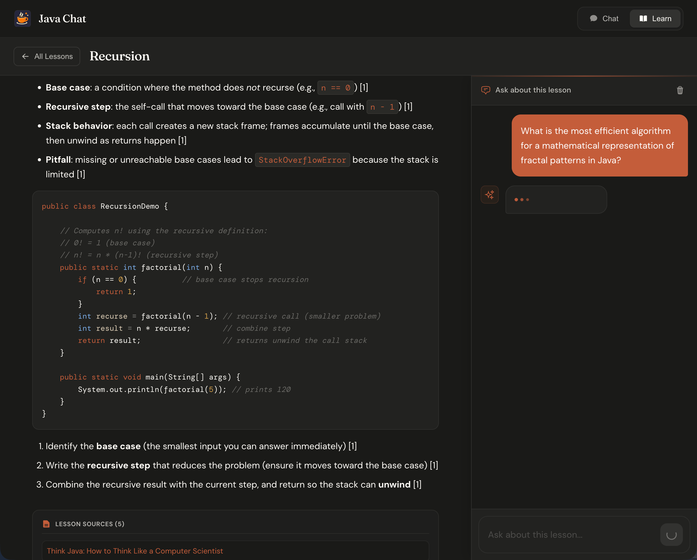

# JavaChat

[](https://javachat.ai)

JavaChat answers software-development questions from retrieved documentation and source code when
supporting sources are available. It streams each answer as it is generated and shows the sources
used. When retrieval cannot support a claim, JavaChat labels it source-unavailable rather than
presenting it as grounded.

Use JavaChat in whichever form fits your workflow:

- **Web:** open [javachat.ai](https://javachat.ai) for chat and guided lessons.
- **Terminal:** install the [JavaChat CLI](cli/README.md) to ask the same grounded questions from
  any directory.
- **Self-hosted development:** run the Svelte and Spring Boot application locally and connect it to
  Qdrant and an OpenAI-compatible gateway.

## Install the CLI

The CLI supports macOS and Linux and requires Node.js 24.18 or newer.

```bash
npm install --global @wcallahan/javachat-cli
javachat auth login
javachat ask "How do Java records work?"
```

Use `javachat list all` to see the documentation packages, source repositories, versions, and
revisions available on the selected deployment. See the [CLI README](cli/README.md) for all
commands, non-interactive authentication, local development, and package verification.

## What JavaChat provides

- Citation-backed chat streamed over Server-Sent Events
- Guided lessons with separate, lesson-scoped conversations
- Version-aware retrieval across documentation and indexed GitHub repositories
- Exact source inventory, including canonical URLs and ingested versions or commit revisions
- A documentation pipeline that fetches, chunks, embeds, deduplicates, and indexes source material
- Hybrid Qdrant retrieval using dense and BM25 sparse vectors with reciprocal-rank fusion

## Run the application locally

### Prerequisites

- BellSoft Liberica JDK 25
- Node.js 24.18
- Docker, when running the local Qdrant service
- `mise` or another Java version manager for the pinned development toolchain

Install the pinned Java version:

```bash
mise install
```

Install and select the frontend's pinned Node.js version with `nvm`:

```bash
nvm install 24.18.0
nvm use 24.18.0
```

Then configure and start the full application:

```bash
cp .env.example .env
# Set OPENAI_BASE_URL and OPENAI_API_KEY in .env.
make compose-up
make dev
```

Open [http://localhost:8085](http://localhost:8085). The local commands create missing Qdrant
schemas only for loopback connections; remote Qdrant deployments remain fail-closed.

For a fuller explanation of the environment variables, local collection setup, and optional
documentation ingestion, read [Getting started](docs/getting-started.md).

## Useful development commands

```bash
make help       # list repository-owned commands
make build      # build the frontend and backend
make test       # run shell contracts and JVM tests
make lint       # run frontend and JVM static analysis
make health     # check the running application
```

To work only on the npm package:

```bash
cd cli
npm install
npm run dev -- --help
npm test
```

## Index documentation and repositories

Documentation ingestion is optional for ordinary application development. Run it only after the
gateway and Qdrant preflight checks pass.

```bash
make full-pipeline
REPO_PATH=/absolute/path/to/repository make process-github-repo
REPO_URL=https://github.com/owner/repository make process-github-repo
SYNC_EXISTING=1 make process-github-repo
```

See [Pipeline commands](docs/pipeline-commands.md) for source selection and ingestion controls, and
[GitHub repository ingestion](docs/github-repository-ingestion.md) for repository synchronization.

## Documentation

- [Documentation index](docs/README.md)
- [Getting started](docs/getting-started.md)
- [Architecture](docs/architecture.md)
- [HTTP and streaming API](docs/api.md)
- [Contributing](CONTRIBUTING.md)

## License

See [LICENSE.md](LICENSE.md).
